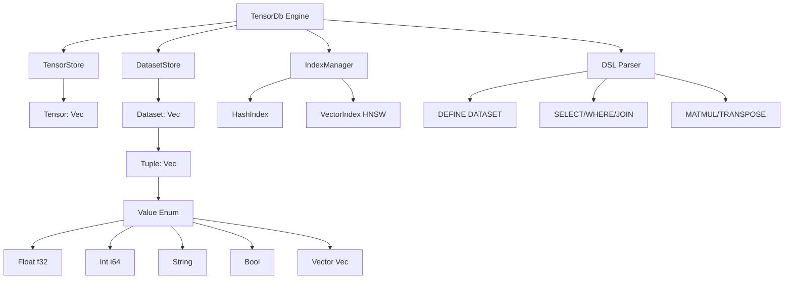

# VectorDB Evolution: Dataset & Tuple Support

Building on the existing tensor foundation to create a comprehensive in-memory vectorial database with support for heterogeneous data, datasets (tables), and advanced query operations.

## Current Foundation Analysis

### ✅ What We Have

**Strong Tensor Foundation:**
- `Tensor` with arbitrary shapes `[d1, d2, ...]` and f32 data
- `Shape` system supporting scalars, vectors, and matrices
- `InMemoryTensorStore` with ID-based storage
- `TensorDb` engine with named tensors and two modes (NORMAL/STRICT)

**Rich Operations:**
- Element-wise: ADD, SUBTRACT, MULTIPLY, DIVIDE
- Vector operations: DOT, COSINE_SIMILARITY, L2_DISTANCE, NORMALIZE
- Scalar operations: SCALE
- Relaxed mode with broadcasting and padding

**DSL & CLI:**
- English-like syntax for tensor operations
- REPL and script execution modes
- Clean error handling

### 🔧 What's Missing for a Vectorial Database

1. **Heterogeneous Data Support**: Currently only f32 tensors
2. **Dataset/Table Abstraction**: No concept of rows/columns with mixed types
3. **Schema System**: No type definitions or constraints
4. **Query Operations**: No filtering, joining, grouping
5. **Matrix Operations**: Missing MATMUL, TRANSPOSE, RESHAPE, SLICE
6. **Indexing**: No efficient lookups or similarity search
7. **Metadata**: No column names, statistics, or data lineage

---

## DSL Design Philosophy

TensorDB DSL is a **human-oriented language** for working with tensors, vectors, matrices, tuples, and datasets using a declarative syntax.

### Core Principles

**1. Logical order over historical syntax**

Instructions are written in the order a human reasons about data:

```
DATASET → FILTER → SELECT → ORDER → LIMIT
```

Not SQL's reversed order (`SELECT ... FROM ... WHERE ... ORDER BY`).

**2. Strong abstraction without hiding meaning**

- No hidden side effects
- No overloaded symbols
- Operations express intent clearly:
  - `FILTER age > 25` (not `WHERE`)
  - `SELECT id, score` (clear projection)

**3. One language, multiple levels**

Same language for:
- Math experiments
- Feature engineering
- Analytics workflows
- Dataset transformations

### Why TensorDB DSL?

> **SQL was designed for tables.**  
> **Tensor libraries were designed for mathematics.**  
> **TensorDB unifies both.**

**SQL explains structure.**  
**TensorDB explains intention.**

---

## Proposed Architecture



---

## Proposed Changes

### Core Data Structures

#### [NEW] `src/value.rs`

New `Value` enum for heterogeneous data:

```rust
#[derive(Debug, Clone, PartialEq)]
pub enum Value {
    Float(f32),
    Int(i64),
    String(String),
    Bool(bool),
    Vector(Vec<f32>),  // Embedding vector
    Null,
}

#[derive(Debug, Clone, PartialEq, Eq)]
pub enum ValueType {
    Float,
    Int,
    String,
    Bool,
    Vector(usize),  // Vector with dimension
}
```

**Features:**
- Type checking and conversion
- Comparison operators
- Serialization support
- Display formatting

---

#### [NEW] `src/tuple.rs`

`Tuple` type for structured records:

```rust
#[derive(Debug, Clone)]
pub struct Schema {
    pub fields: Vec<Field>,
}

#[derive(Debug, Clone)]
pub struct Field {
    pub name: String,
    pub value_type: ValueType,
    pub nullable: bool,
}

#[derive(Debug, Clone)]
pub struct Tuple {
    pub schema: Arc<Schema>,
    pub values: Vec<Value>,
}
```

**Features:**
- Schema validation
- Field access by name or index
- Type-safe operations
- Null handling

---

#### [NEW] `src/dataset.rs`

`Dataset` for table-like collections:

```rust
#[derive(Debug, Clone, Copy, PartialEq, Eq, Hash)]
pub struct DatasetId(pub u64);

#[derive(Debug, Clone)]
pub struct Dataset {
    pub id: DatasetId,
    pub schema: Arc<Schema>,
    pub rows: Vec<Tuple>,
    pub metadata: DatasetMetadata,
}

#[derive(Debug, Clone)]
pub struct DatasetMetadata {
    pub name: Option<String>,
    pub created_at: SystemTime,
    pub row_count: usize,
    pub column_stats: HashMap<String, ColumnStats>,
}
```

**Operations:**
- Row operations: `filter`, `map`, `take`, `skip`
- Column operations: `select`, `rename`, `drop`
- Aggregations: `sum`, `mean`, `min`, `max`, `count`
- Joins: `inner_join`, `left_join`, `right_join`
- Grouping: `group_by` with aggregations
- Sorting: `sort_by`

---

### Enhanced Tensor Operations

#### [MODIFY] `src/ops.rs`

Add matrix operations:

```rust
// Matrix multiplication (rank-2 tensors)
pub fn matmul(a: &Tensor, b: &Tensor, new_id: TensorId) -> Result<Tensor, String>

// Transpose (swap last two dimensions)
pub fn transpose(a: &Tensor, new_id: TensorId) -> Result<Tensor, String>

// Reshape (maintain total elements)
pub fn reshape(a: &Tensor, new_shape: Shape, new_id: TensorId) -> Result<Tensor, String>

// Flatten to 1D
pub fn flatten(a: &Tensor, new_id: TensorId) -> Result<Tensor, String>

// Slice tensor along dimension
pub fn slice(a: &Tensor, dim: usize, start: usize, end: usize, new_id: TensorId) -> Result<Tensor, String>

// Index into tensor
pub fn index(a: &Tensor, indices: &[usize]) -> Result<f32, String>
```

---

### Storage Layer

#### [NEW] `src/dataset_store.rs`

Storage for datasets:

```rust
pub struct DatasetStore {
    next_id: u64,
    datasets: HashMap<DatasetId, Dataset>,
}

impl DatasetStore {
    pub fn insert(&mut self, dataset: Dataset) -> DatasetId
    pub fn get(&self, id: DatasetId) -> Option<&Dataset>
    pub fn get_mut(&mut self, id: DatasetId) -> Option<&mut Dataset>
    pub fn remove(&mut self, id: DatasetId) -> Option<Dataset>
    pub fn list_ids(&self) -> Vec<DatasetId>
}
```

---

#### [NEW] `src/index.rs`

Indexing for efficient queries:

```rust
// Hash index for exact matches
pub struct HashIndex {
    column: String,
    index: HashMap<Value, Vec<usize>>,  // value -> row indices
}

// Vector index for similarity search (simplified HNSW)
pub struct VectorIndex {
    column: String,
    dimension: usize,
    vectors: Vec<(usize, Vec<f32>)>,  // (row_idx, vector)
}

impl VectorIndex {
    pub fn knn_search(&self, query: &[f32], k: usize) -> Vec<(usize, f32)>
}
```

---

### Engine Updates

#### [MODIFY] `src/engine.rs`

Extend `TensorDb` to manage datasets:

```rust
pub struct TensorDb {
    store: InMemoryTensorStore,
    dataset_store: DatasetStore,
    names: HashMap<String, NameEntry>,
    dataset_names: HashMap<String, DatasetId>,
    indices: HashMap<String, Vec<Box<dyn Index>>>,
}

impl TensorDb {
    // Dataset operations
    pub fn create_dataset(&mut self, name: String, schema: Schema) -> Result<(), EngineError>
    pub fn insert_into_dataset(&mut self, name: &str, tuple: Tuple) -> Result<(), EngineError>
    pub fn query_dataset(&self, name: &str, query: Query) -> Result<Dataset, EngineError>
    
    // Index operations
    pub fn create_index(&mut self, dataset: &str, column: &str, index_type: IndexType) -> Result<(), EngineError>
    
    // Matrix operations
    pub fn eval_matmul(&mut self, output: String, a: &str, b: &str) -> Result<(), EngineError>
    pub fn eval_transpose(&mut self, output: String, input: &str) -> Result<(), EngineError>
    pub fn eval_reshape(&mut self, output: String, input: &str, shape: Shape) -> Result<(), EngineError>
}
```

---

### DSL Extensions

#### [MODIFY] `src/dsl.rs`

Redesign DSL with **human-centric logical ordering** and clear intent.

See [DSL Reference](./DSL_REFERENCE.md) for complete syntax documentation.

**Key Features:**
- Logical order: `DATASET FROM → FILTER → SELECT → ORDER`
- VECTOR and MATRIX shorthands
- TUPLE syntax with field access
- DATASET COLUMNS syntax with inline data
- ADD COLUMN for computed fields
- GROUP BY with COMPUTE aggregations
- Matrix operations (MATMUL, TRANSPOSE, RESHAPE, STACK)
- Indexing syntax (m[0, *], tuple.field)

---

## Implementation Phases

### Phase 0: Preparation ✅
- [x] Fix Cargo.toml edition (2024 → 2021)
- [ ] Create NewFeatures.md documentation
- [ ] Update task.md with implementation checklist

### Phase 1: Core Data Types (Estimated: 3-4 hours)
- [ ] Implement `Value` enum with all variants
- [ ] Implement `Tuple` with schema validation
- [ ] Implement `Dataset` with basic operations
- [ ] Add comprehensive unit tests

### Phase 2: Matrix Operations (Estimated: 2-3 hours)
- [ ] Add MATMUL, TRANSPOSE, RESHAPE, FLATTEN, SLICE
- [ ] Update DSL parser for matrix syntax
- [ ] Add integration tests

### Phase 3: Dataset Operations (Estimated: 4-5 hours)
- [ ] Implement filter, select, join, group_by
- [ ] Add aggregation functions
- [ ] Implement sorting
- [ ] Add tests for all operations

### Phase 4: Storage & Engine (Estimated: 2-3 hours)
- [ ] Implement `DatasetStore`
- [ ] Update `TensorDb` to manage datasets
- [ ] Wire up dataset operations in engine

### Phase 5: DSL Extensions (Estimated: 3-4 hours)
- [ ] Add dataset definition syntax
- [ ] Add INSERT, SELECT, WHERE, JOIN syntax
- [ ] Add CREATE INDEX syntax
- [ ] Update SHOW command

### Phase 6: Indexing (Estimated: 3-4 hours)
- [ ] Implement hash index
- [ ] Implement basic vector index (HNSW or brute-force KNN)
- [ ] Integrate with query execution

### Phase 7: Testing & Documentation (Estimated: 2-3 hours)
- [ ] Write comprehensive integration tests
- [ ] Update README with new features
- [ ] Add example scripts
- [ ] Performance testing

**Total Estimated Time: 19-26 hours**

---

## Future Enhancements (Post-MVP)

- Persistence (save/load datasets to disk)
- Transactions and ACID properties
- Concurrent access with locks
- More advanced indices (B-tree, inverted index)
- Query optimizer
- Streaming operations for large datasets
- Python bindings
- REST API server
- Distributed execution
